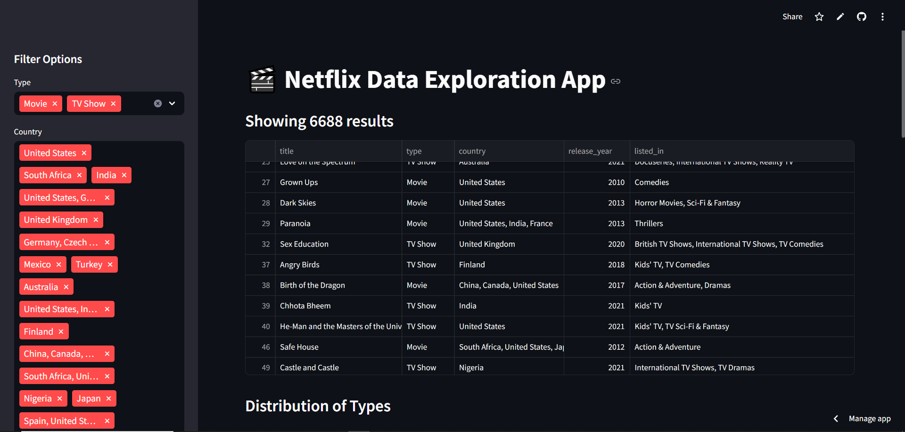
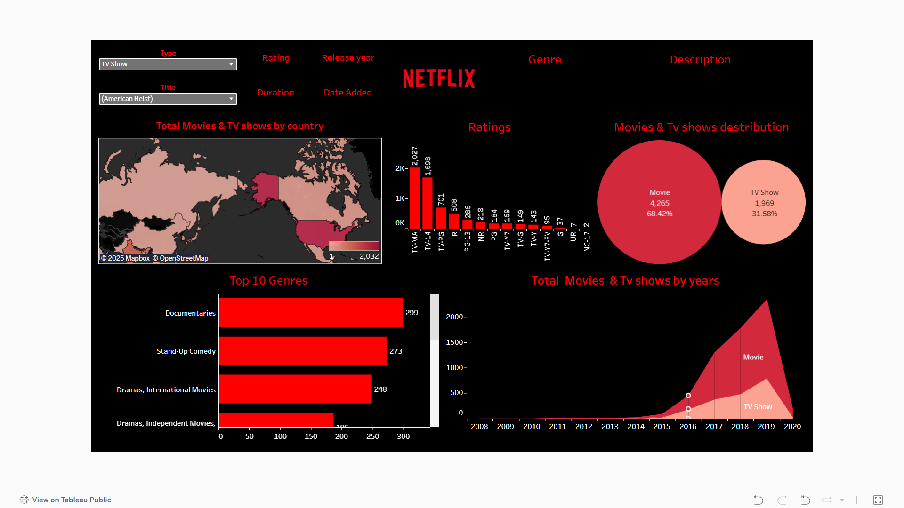

# Netflix-Data-Exploration

# 🎥 Netflix Data Visualization Project

Welcome to the **Netflix Data Visualization Project**! This repository explores and visualizes the Netflix dataset using two complementary approaches:

1. **📊 Streamlit App** – An interactive web application for data exploration and filtering, built with Python and Plotly.
```bash
https://netflix-data-exploration.streamlit.app/
```
or click image below to view

[](https://netflix-data-exploration.streamlit.app/)


2. **📈 Tableau Dashboard** – A rich, interactive dashboard created using Tableau for visual storytelling and insights.
  ```bash
https://public.tableau.com/app/profile/n.mikeck/viz/NetflixMoviesandTvshowsanalysis/Netflix
```
or click image below to view

[](https://public.tableau.com/app/profile/n.mikeck/viz/NetflixMoviesandTvshowsanalysis/Netflix)

---


## 📁 Repository Structure

```plaintext
/
├── streamlit-app/       # Streamlit-based data exploration tool (Python)
│   ├── app.py
│   ├── requirements.txt
│   ├── README.md
│   ├── netflix_movies.csv
│   └── ...
│
├── tableau-viz/         # Tableau visualizations and project files
│   ├── netflix_dashboard.twbx
│   ├── README.md
│   └── ...
│
├── images/
│   ├── tableau.png
│   ├── streamlit.png
│
└── README.md            # You're here!

```
## 📬 Contact

For feedback or inquiries:

- **Name**: Ntwari Mike Chris Kevin
- **Email**: [ntwarikevin95@gmail.com]
- **LinkedIn**: [www.linkedin.com/in/ntwarimikeck]

---

## 📜 License
This project is open source and available under the MIT License.

